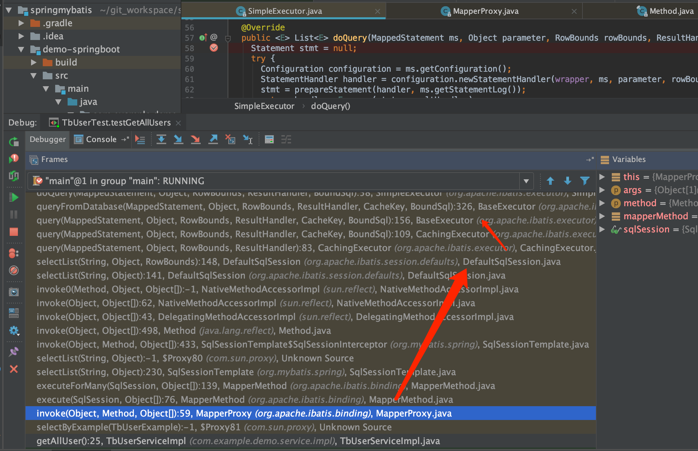
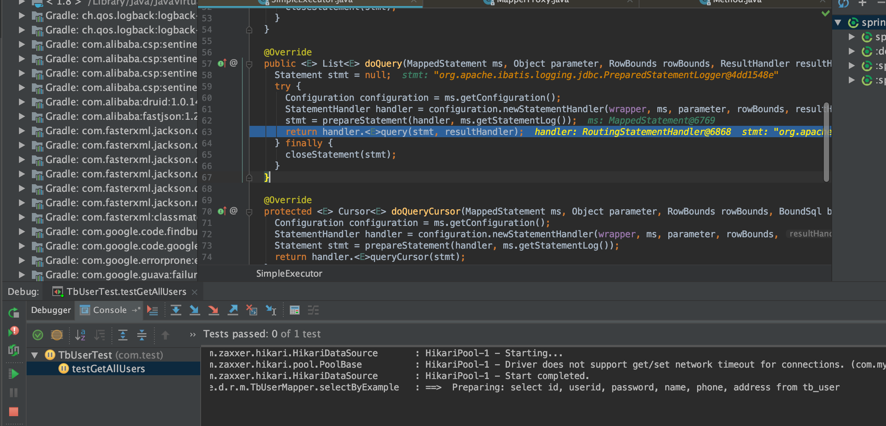

## arthas的使用

<a target='_blank' href="https://doctording.blog.csdn.net/article/details/114218660">Java工具arthas的使用--结合实际工作
</a>

## 数据库&MyBatis

### JDBC操作基本流程

1. 加载JDBC驱动程序

`Class.forName("com.mysql.jdbc.Driver"); //反射`

2. 建立连接

`Connection conn = riverManager.getConnection("jdbc:mysql://localhost:3306/数据库名称","用户名称","密码");`

3. 构造sql，向数据库发出请求

```java
String sql = "select id,username,pwd from t_user where id > ?";
PrepareStatement ps = conn.prepareStatement(sql);
ps.setObject(1, 2); //第一个"问号",传入2. -->把id大于2的记录都取出来
rs = ps.executeQuery();
```

**注**：PreparedStatement对象不仅包含了SQL语句，而且大多数情况下这个语句已经被预编译过，因而当其执行时，只需DBMS运行SQL语句，而不必先编译。当你需要执行Statement对象多次的时候，PreparedStatement对象将会大大降低运行时间，当然也加快了访问数据库的速度。

4. 数据库返回查询结果

`ResultSet rs=ps.executeQuery();`

5. 关闭`RsultSet`，`PreparedStatement`，`connection`

```java
if(rs!=null){ //RsultSet rs
   rs.close();
}
if(ps!=null){ //PreparedStatement ps
   ps.close();
}
if(conn!=null){ //connection conn
   conn.close();
}
```

### mybatis对应的操作过程

1. 加载JDBC驱动程序

2. 建立连接

3. 构造sql，向数据库发出请求

4. 数据库返回查询结果

5. 关闭`RsultSet`，`PreparedStatement`，`connection`

#### 数据库连接&Mapper

工程模块使用：`mybatis-spring-boot-starter`,在`mybatis-spring-boot-autoconfigure`的spring.factories文件如下

```java
# Auto Configure
org.springframework.boot.autoconfigure.EnableAutoConfiguration=\
org.mybatis.spring.boot.autoconfigure.MybatisAutoConfiguration
```

可以看到配置类为`org.mybatis.spring.boot.autoconfigure.MybatisAutoConfiguration`

```java
/**
 * {@link EnableAutoConfiguration Auto-Configuration} for Mybatis. Contributes a
 * {@link SqlSessionFactory} and a {@link SqlSessionTemplate}.
 *
 * If {@link org.mybatis.spring.annotation.MapperScan} is used, or a
 * configuration file is specified as a property, those will be considered,
 * otherwise this auto-configuration will attempt to register mappers based on
 * the interface definitions in or under the root auto-configuration package.
 *
 * @author Eddú Meléndez
 * @author Josh Long
 * @author Kazuki Shimizu
 * @author Eduardo Macarrón
 */
@org.springframework.context.annotation.Configuration
@ConditionalOnClass({ SqlSessionFactory.class, SqlSessionFactoryBean.class })
@ConditionalOnBean(DataSource.class)
@EnableConfigurationProperties(MybatisProperties.class)
@AutoConfigureAfter(DataSourceAutoConfiguration.class)
public class MybatisAutoConfiguration {

   public MybatisAutoConfiguration(MybatisProperties properties,
                                  ObjectProvider<Interceptor[]> interceptorsProvider,
                                  ResourceLoader resourceLoader,
                                  ObjectProvider<DatabaseIdProvider> databaseIdProvider,
                                  ObjectProvider<List<ConfigurationCustomizer>> configurationCustomizersProvider) {
    this.properties = properties;
    this.interceptors = interceptorsProvider.getIfAvailable();
    this.resourceLoader = resourceLoader;
    this.databaseIdProvider = databaseIdProvider.getIfAvailable();
    this.configurationCustomizers = configurationCustomizersProvider.getIfAvailable();
  }
```

可以看到构造函数有很多基础配置信息类；其次有如下的重要bean

* SqlSessionFactory

```java
@Bean
@ConditionalOnMissingBean
public SqlSessionFactory sqlSessionFactory(DataSource dataSource) throws Exception {
  SqlSessionFactoryBean factory = new SqlSessionFactoryBean();
  //中间就是向factory中填充各种属性
  ...
  //最终生成出SqlSessionFactory
  return factory.getObject();
}
```

------什么是SqlSessionFactory?

```java
/**
 * Creates an {@link SqlSession} out of a connection or a DataSource
 * 
 * @author Clinton Begin
 */
public interface SqlSessionFactory {

```

-----什么是SqlSession?

SqlSession表示的是数据库客户端和数据库服务端之间的一种会话，并维护了两者之间的状态信息，能执行sql语句，获取mapper，事务管理

```java
/**
 * The primary Java interface for working with MyBatis.
 * Through this interface you can execute commands, get mappers and manage transactions.
 *
 * @author Clinton Begin
 */
public interface SqlSession extends Closeable {

```

* SqlSessionTemplate

```java
@Bean
@ConditionalOnMissingBean
public SqlSessionTemplate sqlSessionTemplate(SqlSessionFactory sqlSessionFactory) {
  //利用SqlSessionFactory构建出来SqlSessionTemplate
}
```

------什么是SqlSessionTemplate?

SqlSessionTemplate是SqlSession的实现类，线程安全，被spring管理，能结合spring事务管理的

```java
/**
 * Thread safe, Spring managed, {@code SqlSession} that works with Spring
 * transaction management to ensure that that the actual SqlSession used is the
 * one associated with the current Spring transaction. In addition, it manages
 * the session life-cycle, including closing, committing or rolling back the
 * session as necessary based on the Spring transaction configuration.
 * <p>
 * The template needs a SqlSessionFactory to create SqlSessions, passed as a
 * constructor argument. It also can be constructed indicating the executor type
 * to be used, if not, the default executor type, defined in the session factory
 * will be used.
 * <p>
 * This template converts MyBatis PersistenceExceptions into unchecked
 * DataAccessExceptions, using, by default, a {@code MyBatisExceptionTranslator}.
 * <p>
 * Because SqlSessionTemplate is thread safe, a single instance can be shared
 * by all DAOs; there should also be a small memory savings by doing this. This
 * pattern can be used in Spring configuration files as follows:
 *
 * <pre class="code">
 * {@code
 * <bean id="sqlSessionTemplate" class="org.mybatis.spring.SqlSessionTemplate">
 *   <constructor-arg ref="sqlSessionFactory" />
 * </bean>
 * }
 * </pre>
 *
 * @author Putthibong Boonbong
 * @author Hunter Presnall
 * @author Eduardo Macarron
 *
 * @see SqlSessionFactory
 * @see MyBatisExceptionTranslator
 */
public class SqlSessionTemplate implements SqlSession, DisposableBean {

```

-----

Mapper类的扫描？依赖：`org.mybatis.spring.annotation.MapperScan`注解

```java
  /**
   * This will just scan the same base package as Spring Boot does. If you want
   * more power, you can explicitly use
   * {@link org.mybatis.spring.annotation.MapperScan} but this will get typed
   * mappers working correctly, out-of-the-box, similar to using Spring Data JPA
   * repositories.
   */
  public static class AutoConfiguredMapperScannerRegistrar
      implements BeanFactoryAware, ImportBeanDefinitionRegistrar, ResourceLoaderAware {

    private BeanFactory beanFactory;

    private ResourceLoader resourceLoader;

    @Override
    public void registerBeanDefinitions(AnnotationMetadata importingClassMetadata, BeanDefinitionRegistry registry) {

      logger.debug("Searching for mappers annotated with @Mapper");

      ClassPathMapperScanner scanner = new ClassPathMapperScanner(registry);

      try {
        if (this.resourceLoader != null) {
          scanner.setResourceLoader(this.resourceLoader);
        }

        List<String> packages = AutoConfigurationPackages.get(this.beanFactory);
        if (logger.isDebugEnabled()) {
          for (String pkg : packages) {
            logger.debug("Using auto-configuration base package '{}'", pkg);
          }
        }

        scanner.setAnnotationClass(Mapper.class);
        scanner.registerFilters();
        scanner.doScan(StringUtils.toStringArray(packages));
      } catch (IllegalStateException ex) {
        logger.debug("Could not determine auto-configuration package, automatic mapper scanning disabled.", ex);
      }
    }

    @Override
    public void setBeanFactory(BeanFactory beanFactory) throws BeansException {
      this.beanFactory = beanFactory;
    }

    @Override
    public void setResourceLoader(ResourceLoader resourceLoader) {
      this.resourceLoader = resourceLoader;
    }
  }

  /**
   * {@link org.mybatis.spring.annotation.MapperScan} ultimately ends up
   * creating instances of {@link MapperFactoryBean}. If
   * {@link org.mybatis.spring.annotation.MapperScan} is used then this
   * auto-configuration is not needed. If it is _not_ used, however, then this
   * will bring in a bean registrar and automatically register components based
   * on the same component-scanning path as Spring Boot itself.
   */
  @org.springframework.context.annotation.Configuration
  @Import({ AutoConfiguredMapperScannerRegistrar.class })
  @ConditionalOnMissingBean(MapperFactoryBean.class)
  public static class MapperScannerRegistrarNotFoundConfiguration {

    @PostConstruct
    public void afterPropertiesSet() {
      logger.debug("No {} found.", MapperFactoryBean.class.getName());
    }
  }

```

通过学习@Configuration,到学习ConfigurationClassPostProcessor这个bfpp，再到@MapperScan的学习到mybatis的org.mybatis.spring.mapper.MapperScannerConfigurer的bfpp，这样就知道是mybatis是将Mapper的BeanDefinition注册到spring容器中了

具体是`org.mybatis.spring.mapper.ClassPathMapperScanner#doScan`完成对mapper类的扫描，而Mapper实例的生成则是通过MapperFactoryBean来负责

* MapperFactoryBean（mybatis mapper类的工厂bean）

MapperFactoryBean是用来创建MyBatis Mapper对象的，MapperFactoryBean也实现了FactoryBean接口，间接实现InitializingBean接口，主要方法如下

```java
/**
* {@inheritDoc}
*/
@Override
protected void checkDaoConfig() {
   super.checkDaoConfig();

   notNull(this.mapperInterface, "Property 'mapperInterface' is required");

   Configuration configuration = getSqlSession().getConfiguration();
   if (this.addToConfig && !configuration.hasMapper(this.mapperInterface)) {
   try {
      configuration.addMapper(this.mapperInterface);
   } catch (Exception e) {
      logger.error("Error while adding the mapper '" + this.mapperInterface + "' to configuration.", e);
      throw new IllegalArgumentException(e);
   } finally {
      ErrorContext.instance().reset();
   }
   }
}

/**
* {@inheritDoc}
*/
@Override
public T getObject() throws Exception {
   return getSqlSession().getMapper(this.mapperInterface);
}
```

在上述Mapper添加到SqlSession的配置中时，会进行mapper方法上的sql语句解析；这样一个Mapper类就生成并且加入到spring环境中了

#### Executor & Sql执行

当是用mapper类执行sql方法的时候，通过Mapper代理类调用到SqlSession，最后是由mybatis Executor执行的



Executor的所有实现类如下图所示，有SimpleExecutor、BatchExecutor、ReuseExecutor和CachingExecutor等

* ReuseExecutor：就是Statement可以重用的执行器，用map保存sql和Statement，作了一次缓存
* BatchExecutor：批量操作执行器，如果是增删改的时候，commit的时候再执行数据库的操作
* SimpleExecutor：简单的执行器
* CachingExecutor：为 Executor 对象增加了二级缓存的相关功能。

---

java.sql.Statement的创建，可以看到debug可以看到sql也打印出来了（注意，前提是开启sql debug log模式）


